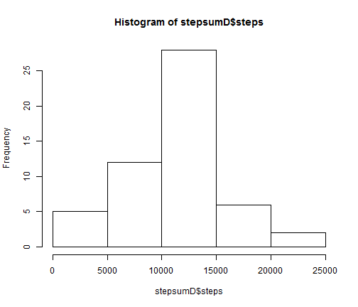
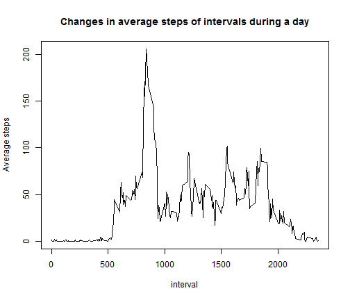
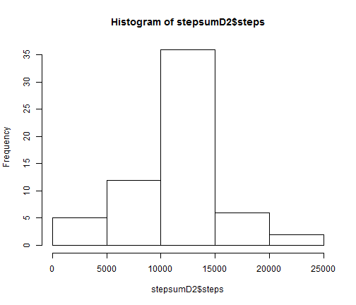
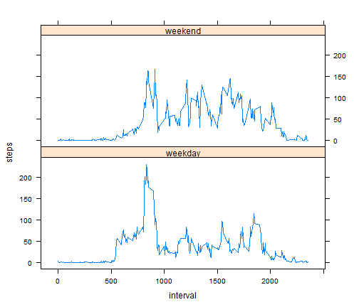

# Reproducible Research: Peer Assessment 1


## Loading and preprocessing the data

```r
setwd("C:/Users/jf08/RepData_PeerAssessment1")
unzip("activity.zip")
activity <- read.csv("activity.csv", header=T, sep=",", quote="\"")
head(activity)
```

```
##   steps       date interval
## 1    NA 2012-10-01        0
## 2    NA 2012-10-01        5
## 3    NA 2012-10-01       10
## 4    NA 2012-10-01       15
## 5    NA 2012-10-01       20
## 6    NA 2012-10-01       25
```

## What is mean total number of steps taken per day?


```r
stepsumD <- aggregate(steps~date, data=activity, FUN="sum")
hist(stepsumD$steps)
```

 

```r
mean(stepsumD$steps)
```

```
## [1] 10766
```

```r
median(stepsumD$steps)
```

```
## [1] 10765
```

## What is the average daily activity pattern?

```r
stepAveInt <- aggregate(steps~interval, data=activity, FUN="mean")
head(stepAveInt)
```

```
##   interval   steps
## 1        0 1.71698
## 2        5 0.33962
## 3       10 0.13208
## 4       15 0.15094
## 5       20 0.07547
## 6       25 2.09434
```

```r
plot(stepAveInt$interval, stepAveInt$steps, type='l', xlab="interval", ylab="Average steps", main="Changes in average steps of intervals during a day", col=1,axes=T)
```

 

```r
subset(stepAveInt, steps==max(stepAveInt$steps))
```

```
##     interval steps
## 104      835 206.2
```

```r
summary(stepAveInt$steps)
```

```
##    Min. 1st Qu.  Median    Mean 3rd Qu.    Max. 
##    0.00    2.49   34.10   37.40   52.80  206.00
```

## Imputing missing values


```r
head(activity)
```

```
##   steps       date interval
## 1    NA 2012-10-01        0
## 2    NA 2012-10-01        5
## 3    NA 2012-10-01       10
## 4    NA 2012-10-01       15
## 5    NA 2012-10-01       20
## 6    NA 2012-10-01       25
```

```r
length(activity[activity$steps=="NA",]$steps)
```

```
## [1] 2304
```

```r
# length(activity$steps)

## p2
# if(activity$steps=="NA"){activity$step=mean(stepAveInt[interval])}
str(activity)
```

```
## 'data.frame':	17568 obs. of  3 variables:
##  $ steps   : int  NA NA NA NA NA NA NA NA NA NA ...
##  $ date    : Factor w/ 61 levels "2012-10-01","2012-10-02",..: 1 1 1 1 1 1 1 1 1 1 ...
##  $ interval: int  0 5 10 15 20 25 30 35 40 45 ...
```

```r
str(stepAveInt)
```

```
## 'data.frame':	288 obs. of  2 variables:
##  $ interval: int  0 5 10 15 20 25 30 35 40 45 ...
##  $ steps   : num  1.717 0.3396 0.1321 0.1509 0.0755 ...
```

```r
activity1 <- merge(activity, stepAveInt, by="interval")
for(i in 1:nrow(activity1)){
  if(is.na(activity1$steps.x[i])){
    activity1$steps.x[i]<-activity1$steps.y[i]
  }
}
head(activity1, 10)
```

```
##    interval steps.x       date steps.y
## 1         0   1.717 2012-10-01   1.717
## 2         0   0.000 2012-11-23   1.717
## 3         0   0.000 2012-10-28   1.717
## 4         0   0.000 2012-11-06   1.717
## 5         0   0.000 2012-11-24   1.717
## 6         0   0.000 2012-11-15   1.717
## 7         0   0.000 2012-10-20   1.717
## 8         0   0.000 2012-11-16   1.717
## 9         0   0.000 2012-11-07   1.717
## 10        0   0.000 2012-11-25   1.717
```

```r
activity2<-data.frame(activity1$steps.x, activity1$date, activity1$interval)
colnames(activity2)<-c("steps","date","interval")
stepsumD2 <- aggregate(steps~date, data=activity2, FUN="sum")
hist(stepsumD2$steps)
```

 

```r
mean(stepsumD2$steps)
```

```
## [1] 10766
```

```r
median(stepsumD2$steps)
```

```
## [1] 10766
```

```r
# summary(stepsumD$steps)
```

## Are there differences in activity patterns between weekdays and weekends?

```r
wd<-weekdays(as.Date(activity2$date))
for(i in 1:length(wd)){
  if(wd[i]=="Saturday" | wd[i]=="Sunday"){
    wd[i]<-"weekend"
  }else{
    wd[i]<-"weekday"
  }
}
activity2$weekday<-wd
head(activity2)
```

```
##   steps       date interval weekday
## 1 1.717 2012-10-01        0 weekday
## 2 0.000 2012-11-23        0 weekday
## 3 0.000 2012-10-28        0 weekend
## 4 0.000 2012-11-06        0 weekday
## 5 0.000 2012-11-24        0 weekend
## 6 0.000 2012-11-15        0 weekday
```

```r
stepAveInt1 <- aggregate(steps~interval+weekday, data=activity2, FUN="mean")
# stepAveInt1 <- aggregate(x=activity2, by=list(interval, weekday), FUN="mean")

head(stepAveInt1)
```

```
##   interval weekday   steps
## 1        0 weekday 2.25115
## 2        5 weekday 0.44528
## 3       10 weekday 0.17317
## 4       15 weekday 0.19790
## 5       20 weekday 0.09895
## 6       25 weekday 1.59036
```

```r
library(lattice)
# ?xyplot
stepAveInt1<-transform(stepAveInt1, weekday=factor(weekday))
xyplot(steps~interval|weekday, data=stepAveInt1, layout=c(1,2), lty=1, type="l")
```

 
